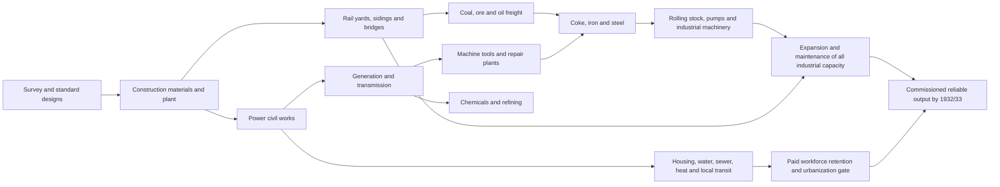

# A counterfactual industrial plan for 1928/29-1932/33

**Research date:** 2026-09-03  
**Baseline:** [Soviet investment at the start of the First Five-Year Plan](soviet-investment-1928.md)  
**Scope:** Industry, Building, and Transport only.  
**Question:** How could the USSR have commissioned more dependable industrial capacity and output by 1932/33 without disorganizing the economy?

## Executive answer

The practical answer is a smaller and more disciplined portfolio than the actual First Five-Year Plan, rolled forward every year. It would concentrate early cash on fuel, electricity, construction materials, rail rehabilitation, and machine tools; sequence large metallurgical and chemical complexes behind those enablers; and stop opening projects whose prerequisites, transport access, or operating labor are not ready.

This report models a **45.0 billion contemporary planning-ruble domestic investment envelope** over 1928/29-1932/33. That is a **counterfactual reconstructed assumption**, not an official historical total and not a subtraction from the 64.6 billion-ruble all-sector plan. It excludes agriculture and grain investment. A separate **5% of 1928 GDP trade envelope**, modeled at approximately **5.0 billion 1937 rubles**, is reserved for imported bottleneck equipment and is not FDI, domestic investment, or an automatic sector allocation.

The model's target is not maximum construction starts. It is the greatest amount of **commissioned, supplied, maintained and freight-accessible capacity** by the end of 1932/33, subject to explicit disorganization limits. On the model's assumptions, the likely result is less spectacular than the original control figures but more reliable: coal roughly 60-65 Mt, crude oil roughly 19-21 Mt, pig iron roughly 7-8 Mt, steel roughly 7-8 Mt, and electricity roughly 16-18 bn kWh by 1932/33. These are **model outputs, not historical claims** and should be treated as ranges rather than point forecasts.

## Rules of the counterfactual

### Fixed exclusions and boundary conditions

* Agriculture and grain are not sectors, portfolio lines, or investment targets.
* Food and procurement enter only as a **fixed exogenous urbanization boundary**: the city population may grow only as fast as an assumed non-investment food flow can feed it. Requisitioning is limited to that requirement. The plan contains no rural extraction target.
* Forced labor, famine, coercive displacement, and forced rural transfer are not feasible inputs. Construction schedules include paid labor, normal migration, training time, housing, and local services.
* Defense is not a separate investment sector. Dual-use machine-building is funded only where it improves civilian industrial equipment, repair, freight, or power-system capacity.
* Rubles are nominal planning rubles in the plan's contemporary price convention. The model does not convert them to modern currency or mix them with the trade envelope without an explicit purchasing-power bridge.

### Objective function

At each annual gate, rank a project by expected commissioned output, not by construction value:

$$
V_i = \frac{p_i\,q_i\,r_i\,u_i}{K_i + C_i}
$$

where $K_i$ is remaining capital cost, $C_i$ is committed operating and network cost before commissioning, $q_i$ is usable physical capacity, $r_i$ is probability of timely completion, and $u_i$ is expected utilization after commissioning. $p_i$ is a shadow value for the bottleneck product, not a claim about a market price. Projects also receive a network bonus when they remove a binding prerequisite for several downstream projects.

The annual optimizer funds only projects that pass four tests:

1. a named prerequisite chain is complete or funded in the same window;
2. materials, power, freight and trained operating labor are available at commissioning;
3. the project remains viable if the next year's cash allocation falls 15%; and
4. its construction does not breach the disorganization constraints below.

## Portfolio and cash allocation

### Five-year domestic portfolio

The following is the model's accounting frame. It is detailed enough to run an allocation exercise, but its branch shares are not historical budget lines.

| Portfolio | 1928/29 | 1929/30 | 1930/31 | 1931/32 | 1932/33 | Five-year total | Classification |
|---|---:|---:|---:|---:|---:|---:|---|
| **Industry** | 2.9 | 3.8 | 4.5 | 4.6 | 4.2 | **20.0** | Counterfactual allocation within the broad historical industry block |
| **Building** | 1.9 | 2.7 | 3.2 | 3.3 | 2.9 | **14.0** | Counterfactual reconstructed block; historical coverage is dispersed |
| **Transport** | 1.7 | 2.0 | 2.3 | 2.6 | 2.4 | **11.0** | Counterfactual allocation near the broad historical transport magnitude |
| **Domestic total** | **6.5** | **8.5** | **10.0** | **10.5** | **9.5** | **45.0** | Model assumption, not an official total |

The declining final-year total is intentional. It leaves a larger share for commissioning, repairs, working capital, and correction of late bottlenecks rather than starting another wave of uncompleted construction.

### Industry detail

| Industry line | Five-year rubles | Share of Industry | What is bought |
|---|---:|---:|---|
| Ferrous metallurgy | 4.4 | 22% | Coke ovens, blast furnaces, open-hearth capacity, rolling and finishing, with ore/coke handling |
| Coal and fuel systems | 2.4 | 12% | Mine development, pit equipment, washing, coal rail sidings, oil storage and pipelines |
| Oil and refining | 1.5 | 7.5% | Field development, pumps, refinery bottlenecks, storage, product handling |
| Electricity generation and transmission | 3.0 | 15% | Turbines, boilers, substations, transmission, fuel-handling and grid interconnection |
| Machine-building and machine tools | 3.7 | 18.5% | Standard machine tools, repair plants, engines, pumps, locomotives and industrial equipment |
| Chemicals | 1.5 | 7.5% | Basic chemicals, coke by-products, industrial gases, fertilizers only as an industrial input; no farm program |
| Nonferrous metallurgy | 1.3 | 6.5% | Copper, lead, zinc and aluminum mining, smelting and refining |
| Construction materials | 1.4 | 7% | Cement, brick, glass, timber processing and quarry equipment |
| Contingency and commissioning | 0.8 | 4% | Spare parts, redesign, grid/rail completion and price or schedule shocks |
| **Industry total** | **20.0** | **100%** |  |

The 4.4 billion-ruble ferrous line does not mean a historical ferrous appropriation of 4.4 billion. It is a portfolio choice designed to prevent iron and steel from consuming cash before coke, power, rail access, refractories, rolling capacity, and repair capability exist.

### Building detail

| Building line | Five-year rubles | Share of Building | Commissioning rule |
|---|---:|---:|---|
| Industrial facilities and site works | 4.4 | 31.4% | Fund only buildings with equipment orders, utility connections and an operating labor plan |
| Power-plant civil works | 1.5 | 10.7% | Match civil completion to turbine/boiler delivery dates |
| Transport civil works | 1.4 | 10% | Grade, bridges, yards, ports and waterways are tied to freight forecasts |
| Worker housing | 2.7 | 19.3% | Housing starts precede labor transfers; count usable floor area, not ceremonial starts |
| Water, sewer, heat and local transit | 2.1 | 15% | Required before a settlement is counted as an operating industrial city |
| Materials, design and construction plant | 1.1 | 7.9% | Standard plans, prefabrication, survey, testing and mobile plant |
| Building contingency | 0.8 | 5.7% | Weather, foundation, utility and local-material shortfalls |
| **Building total** | **14.0** | **100%** |  |

Building is not a residual dumping ground. It is the physical completion budget for industrial plants, power and transport civil works, and the minimum urban systems needed to retain a paid workforce.

### Transport detail

| Transport line | Five-year rubles | Share of Transport | Priority |
|---|---:|---:|---|
| Rail infrastructure | 5.0 | 45.5% | Track renewal, signaling, sidings, yards, bridges, double-tracking on industrial corridors |
| Rolling stock and repair | 2.5 | 22.7% | Locomotives, freight wagons, maintenance shops, standard parts and turnaround capacity |
| Waterways and shipping | 1.2 | 10.9% | Dredging, locks, barges, towboats, navigation and river-to-rail transfer |
| Ports and transshipment | 0.9 | 8.2% | Coal, ore, oil and machinery handling; storage before quayside expansion |
| Roads | 0.8 | 7.3% | All-weather industrial feeder roads, not a national road crusade |
| Transport contingency | 0.6 | 5.5% | Flood, bridge, wagon and maintenance shocks |
| **Transport total** | **11.0** | **100%** |  |

The transport rule is reliability first: remove bottlenecks on a small number of industrial corridors before adding impressive but weakly connected mileage.

## External trade envelope

The baseline gives the only supportable starting point for this sensitivity:

$$
R_{trade}=0.05\times GDP_{1928}\approx0.05\times100=5.0\text{ billion 1937 rubles}
$$

The approximately 100-billion-1937-ruble GDP and the 5% rule are reconstructed/model inputs, not a historical foreign-investment account. The envelope is a purchasing-power ceiling for imports. It is released only against a verified domestic bottleneck and a delivery contract. It is not allocated as another 5 billion across the table above.

| Import gate | Maximum model draw | Eligible items | Release condition |
|---|---:|---|---|
| A: power and grid bottlenecks | 1.6 | Turbogenerators, controls, high-voltage equipment | Civil works, fuel supply and trained operators scheduled |
| B: machine-tool and repair bottlenecks | 1.4 | Precision machine tools, gauges, bearings, specialized repair equipment | Domestic standardization and a maintenance/replication plan |
| C: mining, metallurgy and chemical bottlenecks | 1.2 | Mining machines, refractory or process equipment, specialist instruments | Ore/coke/rail link and commissioning crew verified |
| D: rail and port bottlenecks | 0.8 | Signaling, cranes, locomotives or components unavailable domestically | Corridor throughput model shows a binding constraint |
| **Trade envelope** | **5.0** | **No FDI; no automatic draw** | Unused balance is not spent |

The envelope should not buy general consumer imports, prestige projects, or equipment that domestic plants cannot operate and repair. It also should not be used to conceal an underfunded domestic civil-works package.

## Project chains and dependency graph

The graph changes the sequencing decision. A blast furnace with no coke, rail siding, power, refractories, rolling mill, housing, or repair shop is not capacity; it is an immobilized claim on materials and labor.

### Physical milestones

| Gate | End-date | Required physical evidence |
|---|---|---|
| 0. Design and readiness | 1928/29 | Standard plant designs; surveyed sites; named equipment lists; baseline corridor freight accounts; no project without a utility and labor plan |
| 1. Enablers | 1929/30 | Cement/brick and construction plant expanded; priority rail yards and sidings operating; first grid and mine equipment commissioned; repair shops in service |
| 2. First operating modules | 1930/31 | New generation and transmission modules synchronized; coal/oil handling works operating; machine-tool and locomotive repair output demonstrated; housing and water systems occupied |
| 3. Integrated complexes | 1931/32 | Coke, iron, steel, refining and chemical modules pass trial runs with measured input coefficients; freight corridors meet scheduled turnaround; no critical utility outage backlog |
| 4. Stabilization | 1932/33 | Plants operate for a full seasonal cycle at at least 85% of rated practical capacity; spare-parts stocks and maintenance crews exist; output is delivered over reliable rail/water routes |

## Annual rolling optimization

At the start of each year, the plan is re-estimated using actual prices, delivery times, construction completion, freight performance, labor retention, fuel quality, and operating coefficients. The optimizer carries forward only committed costs for projects that pass their gate.

| Year | Main allocation decision | Annual gate |
|---|---|---|
| 1928/29 | Fund surveys, standard designs, materials, rail rehabilitation, mine/oil preparation, first power civil works and essential housing | Do not authorize a major complex unless its prerequisites have a costed path to completion |
| 1929/30 | Accelerate power, construction materials, machine tools, repair, sidings and worker services | Release second-stage equipment only when civil completion is at least 70% and delivery dates are credible |
| 1930/31 | Fund integrated coke/iron/steel, refining, chemicals and rolling-stock modules with the strongest readiness scores | Cancel or redesign projects with two consecutive schedule misses or input coefficients over plan by more than 15% |
| 1931/32 | Complete the best complexes, expand bottleneck corridors, and buy only verified imports | Freeze new greenfield starts unless they commission by 1932/33 or remove a measured binding bottleneck |
| 1932/33 | Commission, repair, debottleneck and build inventories of spares; no broad new construction wave | Count output only after a full seasonal operating test and freight delivery record |

### Defer and cancel rules

Defer a project when its expected commissioning date slips beyond the remaining plan horizon, when its utility or freight connection is not funded, or when its labor settlement exceeds the urbanization boundary. Cancel it when two annual gates fail, when the revised completion cost rises above 130% of the original estimate without a commensurate bottleneck value, or when it requires coercive labor or displacement.

Protect sunk investments only when the remaining cost to a usable module is less than the expected value of commissioning it. Otherwise, salvage equipment and redirect materials. This rule is uncomfortable but essential: an incomplete complex is not evidence that finishing it is rational.

## Disorganization constraints

These are **model constraints**, not historical measurements. They make “without disorganizing the economy” operational rather than rhetorical.

* **Food/urbanization:** planned urban population growth may not exceed the exogenous food-flow boundary. No investment plan may create a city whose minimum food requirement is not covered by the fixed boundary.
* **Freight:** on priority corridors, scheduled industrial freight delivered must be at least 90% of monthly requirement; wagon turnaround may not worsen by more than 10% for two consecutive quarters.
* **Energy:** reserve margin on the connected industrial grid must remain at least 12% at seasonal peak; no new load is counted as commissioned without fuel-handling and transmission capacity.
* **Construction:** no more than 20% of the domestic portfolio may be in projects below 50% physical completion at an annual gate; the share of projects more than 12 months late must remain below 15%.
* **Labor and housing:** each new industrial job requires a paid labor, training, usable housing, water, sanitation, heat, and local transport plan. Net worker retention below 80% for two quarters triggers a capacity pause.
* **Maintenance:** at least 4% of annual Industry and Transport allocations are protected for spares, repair, and operating tools; they cannot be raided for new starts.
* **Imports:** no imported equipment is ordered without a domestic site, operator, spare-parts route, and commissioning date. Unused trade capacity is not a failure.
* **Macroeconomic warning:** if construction-material prices or delivery arrears rise by more than 15% year over year, new starts are cut before maintenance and completion funding.

## Model output and comparison with the actual plan

| Indicator | Approximate pre-plan base | Original FYP target | Reported c. 1932/33 | Counterfactual model range |
|---|---:|---:|---:|---:|
| Coal, Mt | 35 | 75 | 64 | 60-65 |
| Crude oil, Mt | 11.7 | 22 | 21 | 19-21 |
| Pig iron, Mt | 3.3 | 10 | 6.2 | 7-8 |
| Steel, Mt | 4.3 | 10.4 | 5.9 | 7-8 |
| Electricity, bn kWh | 5.1 | 22 | 13.5 | 16-18 |

The model does not promise that every target exceeds the historical outcome. It deliberately gives up some frontier construction and some maximum coal ambition to improve integration, utilization, maintenance, and completion. Its success criterion is the product of output and reliability, not the count of announced sites.

The actual First Five-Year Plan is the historical comparator, not a failed experiment to be judged by the model's assumptions. The baseline reports the original broad plan figures of approximately 16.4 billion rubles for industry and 10.8 billion for transport, alongside an all-sector 64.6-billion-ruble total, and documents substantial target shortfalls in iron, steel, and electricity. The counterfactual reallocates toward enabling assets, building completion, and transport reliability; it is not claiming that the historical plan could simply have achieved its official targets by spending differently.

### Primary-scan control figures by sector

The linked primary scan, *The Five-Year Plan*, provides a more detailed set of original plan controls than the broad cash and output summaries above. The table preserves the scan's units and distinguishes original controls from later revisions or project indicators. These figures are not additive: project costs sit inside sector totals, and output, capacity, mileage, and capital controls measure different things.

| Category / sector | Original control figure | Unit / horizon | Status and source location |
|---|---:|---|---|
| Electricity: central and regional stations | Increase from 500,000 to at least 3 million kilowatts; the text also says 4 million was more probable | Installed capacity, 1927/28 to 1932/33 | Original computation with an alternative expectation; printed pp. 72-73 |
| Electricity: high-voltage transmission | Increase from 3,000 to 13,000-15,000 kilometers | Lines, five-year period | Original plan indicator; printed p. 73 |
| Electricity: central/regional station construction | More than 3 billion, plus 1 billion for industrial power plants | Rubles, five-year period | Capital control; all power-plant basic capital is described as reaching 5 billion; printed pp. 73-74 |
| Fuel: wood | 50.34 to 58.5 million | Cubic meters, 1927/28 to 1932/33 | Original fuel-consumption control; printed p. 83 |
| Fuel: peat | 5.53 to 14.4 million | Metric tons, 1927/28 to 1932/33 | Original fuel-consumption control; printed p. 83 |
| Fuel: coal | 34.86 to 70.6 million | Metric tons, 1927/28 to 1932/33 | Original fuel-consumption control; printed p. 83 |
| Fuel: crude oil | 7.92 to 12.8 million | Metric tons, 1927/28 to 1932/33 | Original fuel-consumption control, not the extraction target in the output table; printed p. 83 |
| Metallurgy: nonferrous metals | Copper 28.3 to 150.0; zinc 3.15 to 125.0; lead 2.9 to 100.0; aluminum from negligible production to 20.0 | Thousands of metric tons, 1927/28 to 1932/33 | Original plan column; the scan also prints higher revised figures for copper, zinc, and lead; printed p. 100 |
| Metallurgy: nonferrous construction | About 800 million | Rubles, five-year period | Sector capital control; printed p. 101 |
| Machine-building: boilers | 114,000 to 300,000 | Square meters of heating surface, 1927/28 to 1932/33 | Original production control; printed p. 101 |
| Machine-building: Diesel engines | 65,900 to 202,000 | Horsepower, 1927/28 to 1932/33 | Original production control; printed p. 102 |
| Machine-building: turbines | 60,000 to 650,000 | Kilowatts of turbine capacity, beginning to end of period | Original plant output control; printed p. 102 |
| Machine-building: machine tools | 25 million | Rubles for new plants, five-year period | Capital control for new plants only; printed p. 102 |
| Machine-building: mining machinery | 45 million for Kramator plus about 50 million for Sverdlov | Rubles, five-year construction costs | Named project controls; printed p. 102 |
| Machine-building: locomotives | 350 high-powered locomotives at Lugansk in the final year | Units, 1932/33 | Plant output control; the wider locomotive-works reconstruction is up to 100 million rubles; printed p. 103 |
| Machine-building: railway cars | 160 million | Rubles, five-year period | Sector capital control; printed p. 103 |
| Machine-building: automatic couplings | 30-50 million | Rubles, five-year period | Plant-cost control; printed p. 103 |
| Machine-building: shipbuilding | 82 million | Rubles, five-year period | Sector capital control; printed p. 104 |
| Machine-building: automobiles | 100,000 cars annually originally; later 140,000 and then 300,000 | Units, final year | Original and successive revisions are explicitly distinguished; printed p. 104 |
| Machine-building: agricultural implements | 125 million to 610 million originally; later more than 1 billion | Rubles of output, 1927/28 to 1932/33 | Original and revised controls; the capital outlay for the industry is estimated at 180 million rubles; printed p. 105 |
| Chemicals: acid phosphate fertilizers | 150,000 / 271,000 to 3.4 million | Metric tons, 1927/28 / 1928/29 to 1932/33 | Original production control in standard-superphosphate equivalent; printed p. 108 |
| Chemicals: ground phosphorite | 85,000 to 2.5 million | Metric tons annually, 1927/28 to 1932/33 | Original production control; printed p. 108 |
| Chemicals: nitrogen fertilizers | 5,000 to 800,000 | Metric tons annually, ammonium-sulfate equivalent | Original production control; printed p. 108 |
| Chemicals: potassium salts | 1.5 million | Metric tons annually, final year | Original production control; printed p. 108 |
| Chemicals: total fertilizers | 8 million | Metric tons, 1932/33 | Original aggregate control; printed p. 108 |
| Chemicals: construction | 1.4 billion versus about 400 million existing fixed capital | Rubles, five-year construction versus starting fixed capital | Sector capital control; printed p. 108 |
| Chemicals: soda plants | 300,000 at Donetz plus 200,000 at Slavyansk | Metric tons of calcined soda annually | Named plant capacity controls; printed p. 109 |
| Construction materials: cement | 11 million to at least 40 million | Barrels annually, 1927/28 to 1932/33 | Original building-materials production control as printed in the scan; printed p. 114 |
| Construction materials: bricks | 2 billion to 10 billion | Units annually, 1927/28 to 1932/33 | Original building-materials production control; printed p. 114 |
| Construction materials: asbestos | 26,000 to 150,000 | Tons annually, 1927/28 to 1932/33 | Original building-materials production control; printed p. 114 |
| Construction materials: sawed timber | 11 million to 50 million | Cubic meters annually, 1927/28 to 1932/33 | Original building-materials production control; printed p. 114 |
| Construction materials: industry reconstruction | Nearly 1 billion | Rubles, five-year period | Capital control for rebuilding the construction industry; printed p. 114 |
| Transport: new railway lines | 22,600 started, of which 17,000 put into operation | Kilometers, five-year period | Original construction and commissioning controls; printed p. 199 |
| Transport: total railway mileage | About 100,000 | Kilometers, final period | Resulting network indicator; printed p. 199 |
| Transport: new railway cars | About 160,000 | Two-axle units, five-year period | Rolling-stock control; printed p. 199 |
| Transport: railway freight | 85% increase | Freight traffic over the plan period | Original transport-performance control; printed p. 17 in the contemporary summary and discussed in the scan's transport chapter |
| Transport: internal waterways | About 600 million total, including about 275 million for new vessels and about 120 million for waterway works | Rubles, five-year period | Capital controls; printed p. 213 |
| Transport: seaports | More than 200 million | Rubles, five-year period | Capital control; printed p. 211 |
| Building: new housing | 62 million square meters, including 42 million in the socialized sector and 20 million in the private sector | New floor space, five-year period | Housing construction control after allowing for depreciation; printed pp. 228-229 |
| Building: housing investment | 1.5 billion industries; 1.3 billion housing cooperatives; 420 million transport; 780 million municipalities; 960 million individuals | Rubles, five-year period | Institutional investment controls; printed p. 230 |
| Building: municipal construction | More than 2.5 billion | Rubles, five-year period | Municipal facilities and institutions; printed p. 230 |
| Building: roads | No single national five-year quantitative control located in the cited road section | N/A | The scan documents the road network's condition and hard-surface deficit, but does not yield a comparable aggregate target; printed pp. 215-222 |

The scan sometimes reports a later operating-year or post-ratification revision beside the original control. For calibration, the original column is the relevant control figure; revised values are retained only to show how quickly the program changed. The agricultural-implements rows remain in Industry because they measure machine-building output, while agriculture itself remains outside the report's investment scope.

### Additional historical target figures

The following figures broaden the sector coverage without changing the accounting frame above. They are historical targets or plan-period indicators reproduced in Saul G. Bron's contemporary report, *Soviet Economic Development and American Business* (1930). Bron is a contemporary secondary source, not the official plan edition; the figures should therefore be checked against the relevant official control-figure tables before formal calibration.

| Sector / indicator | Original plan target or indicator | Unit / date | Evidence status and caveat |
|---|---:|---|---|
| Agricultural machinery | 55,000 tractors | Units, 1933 | Historical target reproduced by Bron; the report also says agricultural-machinery output value was to quadruple from 1927/28. This is an industrial machinery target, not an agriculture investment allocation. |
| Automobiles | 130,000 cars | Units, 1932/33 | Historical target reproduced by Bron; the printed text contains a typographical year error, which is read from context as 1932/33. |
| Mineral fertilizers | 8 million metric tons | Output, 1932/33 | Historical chemical-sector target reproduced by Bron; fertilizer is a proxy for chemicals, not total chemical output. |
| Cement | Fourfold increase | Output, 1927/28 to 1932/33 | Historical target ratio reproduced by Bron; no absolute final tonnage is supplied in the cited passage. |
| Bricks | Fourfold increase | Output, 1927/28 to 1932/33 | Historical target ratio reproduced by Bron; pieces and tonnage are not interchangeable. |
| Railway freight traffic | 85% increase | Freight traffic over the plan period | Historical transport target reproduced by Bron; this measures traffic, not route capacity or reliability. |
| Railway construction and improvements | 9.52 billion | Rubles in 1926/27 prices, five years | Historical plan-period investment figure reproduced by Bron; it is narrower than the broader transport aggregate and is not added to the counterfactual portfolio. |
| Non-farm buildings and structures | Increase from 2.6 to 12.5 billion | Rubles in 1926/27 prices, 1927/28 to 1932/33 | Historical construction aggregate reproduced by Bron; it is not a standalone housing target. |
| Worker housing | 758 million spent | Rubles, 1928/29 reported expenditure | Historical first-year outcome reproduced by Bron, not a five-year target. |
| Industrial buildings | 885 million spent | Rubles, 1928/29 reported expenditure | Historical first-year outcome reproduced by Bron, not a five-year target. |
| Transportation structures | 556 million spent | Rubles, 1928/29 reported expenditure | Historical first-year outcome reproduced by Bron, not the railway investment target above. |

These figures should be read alongside the existing output table, not merged into it. The machinery, fertilizer, cement, brick, railway-traffic, railway-investment, and non-farm-building rows are evidence about the original plan's intended scale. The three 1928/29 expenditure rows document implementation, while the counterfactual building and transport lines remain model assumptions.

## Conceptual resolution versus execution and source survival

The evidence supports a mixed answer. Soviet planners had **low conceptual resolution at the project-network level**: they understood heavy-industry priorities and could name flagship projects, but control figures often compressed power, rail, housing, materials, labor, repair, and operating coefficients into sector totals. That made the plan look more determinate than the commissioning chain really was.

The larger practical problem was **administrative execution under poor information and unstable constraints**. Surviving records are uneven: official plans preserve intentions and selected physical targets, while budgets, construction accounts, equipment deliveries, local utilities, labor retention, and reliable realized output are often held in different classifications. Later archival work shows why plan targets, allocations, reported fulfillment, and actual operating capacity must not be treated as one series. Source survival therefore limits exact reconstruction, but it does not fully explain the observed gap. A rolling gate system, better project accounting, standardization, and willingness to defer would have addressed an execution problem as well as an information problem.

## Historical evidence and counterfactual assumptions

| Statement | Type |
|---|---|
| The original FYP had about 64.6 billion rubles of total capital investment, with broad published industry and transport blocks of about 16.4 and 10.8 billion | Historical evidence as summarized in the baseline; coverage and price basis require care |
| Coal, oil, iron, steel and electricity targets and approximate 1932/33 outcomes in the comparison table | Historical evidence, with source-definition and reporting cautions |
| Heavy-industry projects were vertically dependent on fuel, power, materials, rail, housing and repair | Historical interpretation supported by the official plan's sector/project structure; the graph is a model representation |
| 45.0 billion domestic portfolio and its branch/year shares | Counterfactual reconstructed assumption |
| 5.0 billion trade envelope and its import gates | Counterfactual application of the user's 5% GDP rule; not FDI |
| Output ranges, disorganization thresholds, 85% practical-capacity test and defer/cancel rules | Counterfactual model assumptions |
| No forced labor, famine, rural extraction or coercive displacement | Feasibility constraint specified for this counterfactual |

## Sources and citation limits

1. **USSR, *The First Five-Year Plan of the Development of the National Economy of the U.S.S.R., 1928/29-1932/33***, English translation of official control figures (1930). Internet Archive catalog: <https://archive.org/search?query=%22First%20Five-Year%20Plan%22%20USSR>. Consult the printed sections/tables headed capital construction, fuel, metallurgy, electricity, and transport. Pagination varies by scan; this report does not invent scan-page precision.
2. **Alec Nove, *An Economic History of the U.S.S.R., 1917-1991*, 3rd ed.** (1992), pp. 168-175. Publisher/record search: <https://books.google.com/books?q=Alec+Nove+An+Economic+History+of+the+USSR+3rd+edition>. Used for broad plan investment and comparability cautions.
3. **Robert C. Allen, *Farm to Factory: A Reinterpretation of the Soviet Industrial Revolution*** (2003), pp. 64-72. Princeton record/search: <https://press.princeton.edu/search?search=Farm%20to%20Factory%20Robert%20Allen>. Used for reconstructed GDP context and the industrialization narrative, not as an official budget.
4. **R. W. Davies, Mark Harrison and S. G. Wheatcroft, *The Economic Transformation of the Soviet Union, 1913-1945*** (1994), pp. 180-230. Cambridge record: <https://www.cambridge.org/core/books/economic-transformation-of-the-soviet-union-19131945/>. Used to cross-check output magnitudes and distinguish plan from realized series.
5. **Paul R. Gregory and Mark Harrison, “Allocation under Dictatorship: Research in Stalin's Archives,” *Journal of Economic Literature* 43, no. 3 (2005), pp. 721-761.** DOI: <https://doi.org/10.1257/002205105774431225>. Used for the archival and administrative-information caution.
6. **Saul G. Bron, *Soviet Economic Development and American Business* (1930).** Internet Archive scan: <https://archive.org/details/sovieteconomicde0000saul>. Used as a contemporary secondary reproduction for the additional machinery, chemicals, construction-materials, railway, and construction targets; see the sections headed “Industrial Program” and “Transportation, Finance and Foreign Trade,” printed pp. 14-17. It is not substituted for the official plan tables.
7. **The Five-Year Plan**, Internet Archive scan: <https://archive.org/details/in.ernet.dli.2015.223354>. Used as the primary plan text for the sector control figures in the table above; printed page references are to the scan's internal pagination and should be checked against the page image because OCR introduces spacing and transcription errors.
8. The baseline report at [soviet-investment-1928.md](soviet-investment-1928.md) records the source reconciliation, rounded physical series, and the reason branch-level historical cash lines are not presented as additive facts.

The report's historical figures should be re-run from one edition of the official plan and one consistent statistical series before formal calibration. The counterfactual tables are intentionally transparent model inputs, not disguised archival discoveries.

## Investment options: factories, sites, and expansion mode

The recommended portfolio is reliability-first: approximately 70-80% of domestic capital goes to brownfield expansion and enabling systems, while 20-30% is reserved for gated greenfield or frontier modules. The purpose of this split is to maximize **commissioned capacity** by 1932/33, not the number of construction starts. The percentages below are planning allocations within the existing 45.0-billion-ruble Industry, Building, and Transport envelope; they are not historical appropriations and must not be added to that envelope.

### Recommended site portfolio

| Site or system | Mode | Factory or works to build | Why locate or expand there | Infrastructure and workforce conditions | 1932/33 treatment |
|---|---|---|---|---|---|
| Donbass | Brownfield expansion | Coal mines, pit equipment, washing, coke ovens, ore and coal handling, and selected existing iron and steel bottlenecks | Existing fuel and metallurgical base supports the western industrial network | Rehabilitated rail sidings and yards, dependable mine power, coke quality control, paid local hiring and trained miners | Core brownfield package; expand only where rail and washing capacity are commissioned with the mine output |
| Baku and Grozny | Brownfield expansion | Pumps, field equipment, refinery bottlenecks, storage, pipelines, and product handling | Existing oil centers reduce site, training, and utility risk | Tankage, pipeline links, port or rail loading, maintenance shops, and paid skilled labor | Prioritize dependable crude and refined-product flows over a headline extraction target |
| Lugansk | Brownfield expansion | Locomotives, freight equipment, repair shops, standard parts, and industrial machinery | Existing locomotive works can improve both production and the reliability of the freight network | Machine tools, steel and forgings, component standards, worker housing, and technical training | Fund reconstruction and repair capacity before ambitious final-year output targets |
| Existing rail corridors and yards | Brownfield rehabilitation | Track renewal, bridges, signaling, sidings, yards, locomotives, wagons, and repair facilities | Removes the binding constraint on coal, ore, fuel, machinery, and construction materials | Select corridors by measured bulk-freight accounts; protect maintenance capacity and wagon turnaround | First transport priority; new mileage is secondary to reliable throughput |
| Existing power systems | Brownfield expansion | Thermal generating units, substations, transmission, controls, fuel handling, and repairs | Distributed additions deliver usable power sooner and avoid dependence on one frontier project | Fuel supply, grid interconnection, trained operators, and a 12% seasonal reserve margin | Core power package; no industrial load counts as commissioned without transmission and fuel support |
| Construction-material plants | Brownfield expansion with selective new capacity | Cement, brick, glass, timber processing, quarry equipment, and mobile construction plant | Early materials capacity prevents delay across factories, housing, power, and transport | Reliable rail or water supply, standard designs, testing, and paid construction crews | Front-load before major factory equipment; treat output units separately |
| Kramator and Sverdlov | Conditional candidate | Mining machinery, pumps, hoists, and heavy repair equipment | Potentially valuable upstream machine-building capacity | Verify baseline capacity, site status, equipment list, skilled workforce, utilities, and comparable cost basis | Release only after the readiness packet; historical project figures remain controls, not budgets |
| Donetz and Slavyansk | Conditional expansion | Soda and related basic chemical capacity | Existing named locations may support industrial chemical supply | Verify whether each item is a new plant or expansion; require feedstock, rail, power, operators, and maintenance | Fund only the module with a credible commissioning path; do not merge original and revised targets |
| Dnieper | Modular greenfield | Hydroelectric generation, transmission, substations, and associated civil works | Adds major power potential to the western network | Build transmission and independently useful sections first; provide backup fuel, materials, operators, and housing | Valuable enabler, but no downstream factory may depend on an optimistic dam completion date |
| Magnitogorsk | Staged greenfield flagship | Ore and coke handling, coke ovens, blast furnaces, steelmaking, rolling, refractories, repair, and utilities | One integrated eastern complex offers post-1933 scale without duplicating frontier risk | Dedicated rail account, ore and coke supply, power and reserve margin, cement and refractories, housing, water, sanitation, heat, paid labor, training, and spares | Provisional flagship; release major equipment only after all readiness gates pass |
| Kuznetsk | Deferred frontier option | Integrated metallurgy and associated utilities | Strategic alternative, but funding both eastern complexes would dilute rail, equipment, and labor | Maintain surveys and comparable site evidence; do not begin a competing full build during this horizon | Fallback or post-1933 option unless Magnitogorsk fails its release gates |

The portfolio does not assume that a named site has adequate infrastructure merely because it appears in a historical plan. Site status, starting capacity, cost classification, and workforce conditions must be verified before a historical control figure is converted into a project budget.

### Brownfield allocation guide

Within the brownfield majority, use the following indicative shares. They sum to 100% of the brownfield package and are allocation ranges for the model, not historical accounting lines.

| Brownfield package | Indicative share | Main uses |
|---|---:|---|
| Transport and rolling stock | 25% | Rail rehabilitation, yards, sidings, bridges, locomotives, wagons, signaling, and repair |
| Power and grid | 20% | Distributed thermal units, substations, transmission, controls, fuel handling, and maintenance |
| Fuel and existing metallurgy | 20% | Donbass mines and coke, oil systems, ore handling, and debottlenecking of existing iron and steel |
| Machine-building and repairs | 15% | Lugansk, verified Kramator/Sverdlov modules, standard machine tools, pumps, and spare parts |
| Construction materials and worker infrastructure | 15% | Cement, brick, timber, site works, housing, water, sewer, heat, and local transit |
| Chemicals and ports | 5% | Verified soda or basic-chemical expansions, storage, loading, and port or waterway handling |
| **Total** | **100%** | **Brownfield package** |

The remaining 20-30% of domestic capital is the gated greenfield and frontier package, including Magnitogorsk, modular Dnieper works, and only those new settlements and connections that make a commissioned module operable. The existing 20.0-billion Industry, 14.0-billion Building, and 11.0-billion Transport totals remain unchanged; each project must be mapped to one of those accounts before authorization. The separate 5.0-billion trade envelope remains outside domestic investment and rolls forward when no verified import bottleneck is ready.

### Phasing and release gates

**1928/29: prepare and repair.** Fund surveys, standard designs, construction-material plants, rail rehabilitation, mine and oil preparation, distributed power repairs, machine-tool and locomotive shops, and the first housing and utility works. Begin Magnitogorsk surveys and civil works only where those works have independent value.

**1929/30: complete enablers.** Expand priority yards, sidings, rolling stock, grid connections, mines, coke handling, construction materials, repair shops, housing, water, sanitation, and heat. Release second-stage equipment only when civil completion is at least 70% and delivery dates are credible.

**1930/31: install integrated modules.** Commission the strongest brownfield additions and begin Magnitogorsk's ore, coke, power, utilities, and first production modules. Release imported equipment only against a verified domestic site, operator plan, spare-parts route, and commissioning date.

**1931/32: integrate and select.** Complete the best rail corridors and industrial modules. Freeze new greenfield starts unless they will commission within the horizon or remove a measured binding bottleneck. Compare Magnitogorsk's actual readiness with the evidence packet before releasing its major equipment balance.

**1932/33: stabilize output.** Prioritize trial runs, repairs, spare parts, inventories, freight delivery, and correction of late bottlenecks. Count new capacity only after a full seasonal operating test at at least 85% of rated practical capacity with trained labor and maintenance support.

### Readiness packet and fallback rule

Every major site requires a readiness packet before second-stage capital:

1. Verified baseline capacity and clear classification as brownfield, greenfield, modular greenfield, or conditional candidate.
2. A rail, water, or port freight account showing inputs can arrive and output can leave; priority corridors must deliver at least 90% of monthly industrial freight requirements.
3. A power and fuel plan with connection dates, fuel handling, trained operators, and the 12% seasonal reserve margin.
4. A construction-materials and equipment schedule covering cement, brick, refractories, machinery, delivery dates, installation, and testing.
5. A paid labor plan combining local training with voluntary paid migration, plus usable housing, water, sanitation, heat, food-flow capacity, and local transport. Worker retention below 80% for two quarters pauses expansion.
6. A maintenance and spare-parts plan, with the protected repair allocation intact.
7. A comparable cost basis that distinguishes civil works, equipment, working capital, and operating costs.

Magnitogorsk's second-stage funds are diverted to Donbass, existing steel, rail, or other verified bottlenecks if it misses two annual gates, lacks a funded critical prerequisite, exceeds 130% of its comparable cost estimate without proportional bottleneck value, or no longer has a credible path to a full seasonal operating test by 1932/33. Kuznetsk then remains a prepared fallback, not an automatic substitute with its own unverified budget.

### Portfolio sensitivities

| Case | Change from base | Likely result by 1932/33 | Main risk |
|---|---|---|---|
| Reliability-first base | Brownfield majority; Magnitogorsk staged; Dnieper modular | Highest probability of usable coal, power, machinery, and freight capacity; moderate frontier output | Lower post-1933 eastern scale if the flagship is delayed |
| Earlier greenfield expansion | Release Magnitogorsk equipment before all readiness gates | Greater long-run steel potential if execution succeeds | Unfinished capacity, freight congestion, labor loss, and power shortfalls within the plan horizon |
| Kuznetsk substitution | Replace Magnitogorsk only after a comparative evidence review | Preserves one-flagship discipline while changing the eastern logistics case | No basis for substitution without verified rail, ore, coke, power, and workforce data |
| Deeper brownfield concentration | Shift greenfield funds to Donbass, existing steel, rail, power, and repairs | Most dependable near-term output and lower coordination risk | Smaller post-1933 frontier capacity and possible loss of scale economies |

The base case is recommended because it aligns factory location with existing infrastructure and workforce capability while preserving one controlled route to larger post-1933 metallurgy. These are counterfactual recommendations, not claims that the historical plan used this portfolio or that the model can identify site-level costs more precisely than the surviving evidence permits.